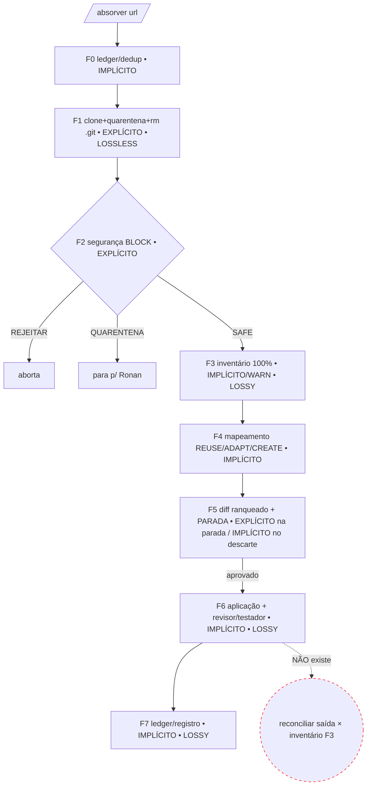

# 02 — Reconstrução do workflow real de `/absorver`

> Reconstruído a partir dos arquivos, não do que "se espera". Cada passo cita `arquivo:linha` e é marcado `[EXPLÍCITO]` (codificado/instruído, com reforço determinístico) ou `[IMPLÍCITO]` (depende do modelo "fazer a coisa certa" sem trava). **Todo passo `[IMPLÍCITO]` é ponto de falha em potencial.**

## Quem recebe o pedido

O usuário digita `/absorver <url>` → `Caos/.claude/commands/absorver.md:5-9` instrui o CAOS a usar a habilidade `ingestao-de-repositorio`. O CAOS (orquestrador) conduz; delega a subagentes nos gates. **Hermes não participa** (ver `01_censo.md §2`). `[VERIFICADO]`

## Sequência real (passo a passo)

| # | Passo | Fonte | Tipo | Lossless / Lossy |
|---|---|---|---|---|
| 1 | Normaliza URL, lê ledger `repositorios-absorvidos.yaml`, resolve SHA via `gh` sem clonar | `ingestao/SKILL.md:15-25` | **[EXPLÍCITO]** | lossless (dedup) |
| 2 | Veredito F0: NOVO / JÁ-ABSORVIDO(mesmo SHA→para) / SHA-novo(incremental) / rejeitado | `ingestao/SKILL.md:18-25` | **[IMPLÍCITO]** — comparação de SHA e decisão são juízo do modelo; nenhum reflexo valida | — |
| 3 | F1: `git clone --depth 1` → `_staging/quarentena/<owner>--<repo>@<sha>/` | `ingestao/SKILL.md:27-34`; `absorver.md:13-14` | **[EXPLÍCITO]** | **lossless** (cópia crua) |
| 4 | F1: captura SHA, **remove `.git`**, grava `_procedencia.md` | `ingestao/SKILL.md:30-32` | **[EXPLÍCITO]** (reforço `bloqueio-de-quarentena.sh`) | lossless |
| 5 | F2: delega `auditor-de-seguranca` → análise 100% estática + Egide → SAFE/QUARENTENA/REJEITAR (gate BLOCK) | `ingestao/SKILL.md:36-43`; `auditor-de-seguranca.md:50-59` | **[EXPLÍCITO]** (BLOCK; reflexo impede execução) | n/a (segurança, não conteúdo) |
| 6 | F3: **inventário de capacidades** → `registros/absorcao/<repo>/inventario-de-capacidades.md` (capacidade→tipo→keywords→domínio→fonte) | `ingestao/SKILL.md:45-49` | **[IMPLÍCITO]** — gate é **WARN se <100%**, não BLOCK; nenhum reflexo verifica se o arquivo foi gravado | **lossy** (é aqui que a fidelidade do inventário decide tudo) |
| 7 | F4: para cada capacidade, `consulta-ao-registro` → REUSE(≥0.90)/ADAPT(0.60-0.89)/CREATE | `ingestao/SKILL.md:51-56` | **[IMPLÍCITO]** — limiares de relevância são juízo do modelo | lossy (classificação) |
| 8 | F5: `auditoria-de-squad` (benchmark=repo) → plano **ranqueado por valor**; PARA p/ aprovação (BLOCK) | `ingestao/SKILL.md:57-62`; `auditoria-de-squad/SKILL.md:42-60` | **[EXPLÍCITO]** na parada; **[IMPLÍCITO]** no que o ranking descarta | **lossy** (ranqueamento descarta cauda) |
| 9 | F6: aplica via `criacao-de-*` + `heranca-de-especialista`; `revisor` (N0→N6) + `testador` (maturity ≥7.0) | `ingestao/SKILL.md:64-68` | **[IMPLÍCITO]** — a verificação confere **PRD+checklist**, não o inventário da F3 | **lossy** (transformação generativa) |
| 10 | F7: `curador` grava ledger, `origem: repo@SHA`, `_origem.md`, histórico, memória | `ingestao/SKILL.md:70-77` | **[IMPLÍCITO]** — granularidade do campo `capacidades` é juízo do modelo | lossy (resumo) |

## Fluxo (mermaid)

## Onde é lossless vs lossy

- **Lossless (cópia crua):** apenas F1 — o `git clone` para a quarentena. Aqui nada se perde. **Mas a quarentena é "gitignored / limpável após a absorção"** (`ingestao/SKILL.md:84`), ou seja, **a fonte da verdade imutável é DESCARTÁVEL**, não permanente.
- **Lossy (generativo):** F3 (inventário), F5 (diff ranqueado), F6 (reescrita em pt-BR "extrair padrão, nunca copiar literal" — `ingestao/SKILL.md:83`), F7 (resumo no ledger).

## Etapas `[IMPLÍCITO]` (pontos de falha — lista explícita)

1. **F0** — comparação de SHA / veredito de dedup: juízo do modelo, sem trava.
2. **F3 — completude do inventário:** gate é **WARN**, não BLOCK; **nenhum reflexo verifica que `inventario-de-capacidades.md` foi sequer gravado**. (Na única corrida real, não foi — ver `04`.)
3. **F4** — limiares 0.90/0.60 de relevância: juízo subjetivo do modelo.
4. **F5 — "ranqueado por valor":** o que cai abaixo da linha é descartado sem que nenhuma etapa exija "todo item do inventário recebe uma disposição explícita".
5. **F6 — verificação:** `revisor` e `testador` auditam contra **PRD + checklist de qualidade**, **nunca contra o inventário da F3**. Não há passo que emita "capacidades inventariadas que NÃO foram absorvidas".
6. **F7 — granularidade do ledger:** o campo `capacidades` é preenchido a critério do modelo (resultou em 3 bullets de prosa — ver `04`).
7. **Reconciliação final (Pilar 5):** **não existe nenhuma etapa** que confronte o resultado absorvido contra o gabarito da F3 e reporte o que ficou de fora. (Nó vermelho tracejado no diagrama.)

## Conclusão da Fase 2

O pipeline é **forte e determinístico na metade da segurança/preservação** (F1/F2 com reflexo BLOCK) e **fraco e dependente-de-prompt na metade da preservação-de-capacidade** (F3→F7, todas `[IMPLÍCITO]`). O elo que fecharia o laço anti-perda — **reconciliar a saída contra o inventário** — está **ausente do workflow**, não apenas fraco.
