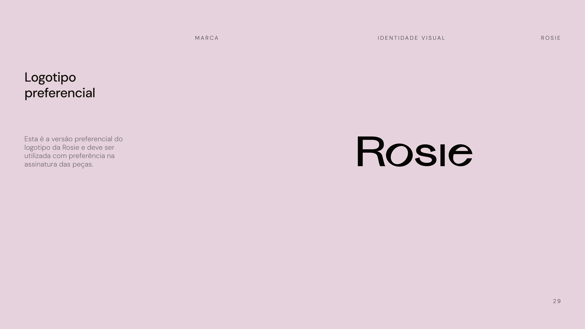
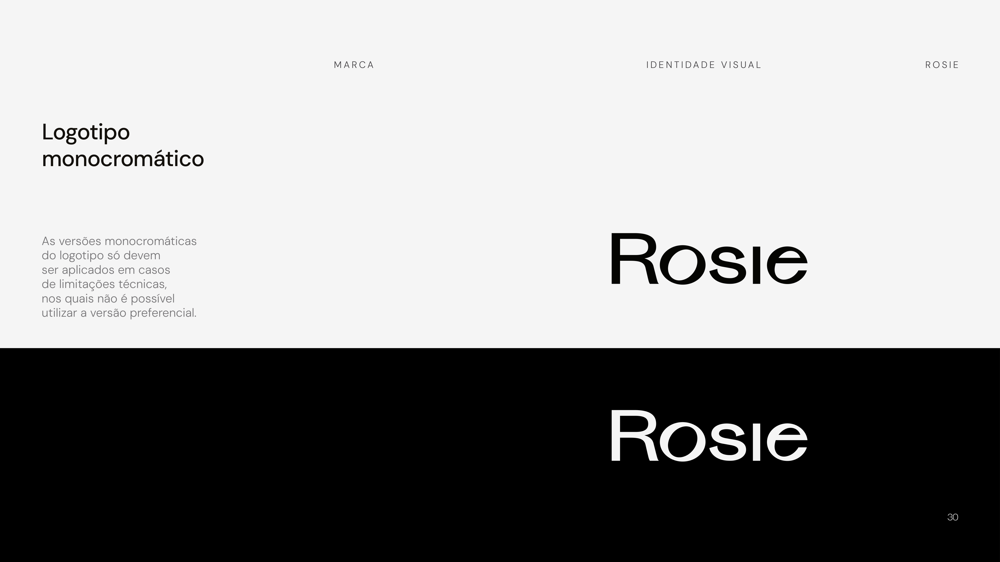

# Marca / Logotipo

> Pilar 3 de 3 do Manual de Marca Rosie — Identidade Visual. *(Fonte: manual, p. 27–32.)*
> A flexibilidade na maneira de assinar as peças assegura a integridade visual da marca, seja qual for o formato do layout.

## Logotipo preferencial

Esta é a **versão preferencial** do logotipo da Rosie e deve ser utilizada com preferência na assinatura das peças. Wordmark autoral "Rosie", em preto, com terminais refinados de inspiração fashion. *(p. 29.)*

## Logotipo monocromático

As versões **monocromáticas** do logotipo só devem ser aplicadas em **casos de limitações técnicas**, nos quais não é possível utilizar a versão preferencial. *(p. 30.)*

## Resguardo e redução

- **Redução máxima:** **80 px** para materiais digitais e **15 mm** para peças impressas.
- **Área de proteção:** para resguardar o elemento, foi estabelecida uma área de proteção equivalente a **½ da altura do elemento (X)** em todos os lados. *(p. 31.)*

## Boas práticas — usos incorretos

Exemplos de usos que comprometem a legibilidade e a consistência da logomarca. **Não fazer:** *(p. 32.)*

- ❌ Aplicar cores que **não estão na paleta** da marca.
- ❌ **Distorcer** as proporções originais.
- ❌ Aplicar a marca **rotacionada**.
- ❌ Alterar o **espaçamento das letras**.
- ❌ Utilizar em **contorno** (outline).
- ❌ Utilizar **efeitos visuais** nem **opacidade**.

> **Arquivo vetorial oficial (SVG/AI/EPS):** não acompanha o PDF. Solicitar ao time de marca para produção. As imagens acima são renders das páginas do manual.
