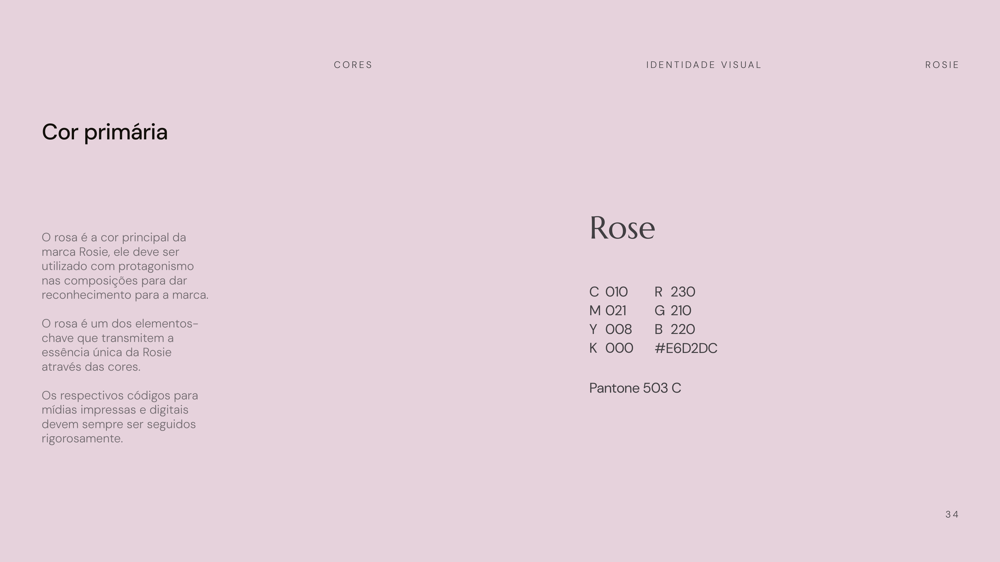

# Cores

> *(Fonte: manual, p. 33–36.)*
> As cores definidas para o universo visual da Rosie a tornam **proprietária**, capaz de se destacar tanto em meios digitais quanto impressos. Os códigos para mídias impressas e digitais devem **sempre ser seguidos rigorosamente**.

## Cor primária — Rose

O **rosa é a cor principal** da marca Rosie. Deve ser utilizado com **protagonismo** nas composições para dar reconhecimento à marca — é um dos elementos-chave que transmitem a essência única da Rosie. *(p. 34.)*

| | Rose |
|---|---|
| **HEX** | `#E6D2DC` |
| **RGB** | 230 / 210 / 220 |
| **CMYK** | 10 / 21 / 8 / 0 |
| **Pantone** | 503 C |

## Paleta primária (neutros)

A paleta primária em **tons neutros** serve de base para destacar a cor principal. Com nuances do branco ao cinza e um **tom de preto especial** (quente), realça o rosa e confere à Rosie uma qualidade **atemporal e adaptável**. *(p. 35.)*

| Cor | HEX | RGB | CMYK | Pantone |
|-----|-----|-----|------|---------|
| **White** | `#FFFFFF` | 255 / 255 / 255 | 0 / 0 / 0 / 0 | — |
| **Black** | `#14100C` | 020 / 016 / 012 | 70 / 67 / 68 / 83 | Black 5 C |
| **Grey** | `#EBEBEB` | 235 / 235 / 235 | 7 / 5 / 5 / 0 | Cool Gray 1 C |

> Observação: o manual também nomeia **"White wood"** como neutro de base, na mesma família clara.

## Paleta secundária

Complementa a identidade visual: um **tom mais claro de rosa** (uso pontual) e um **cinza mais escuro**, dando versatilidade às composições. *(p. 36.)*

| Cor | HEX | RGB | CMYK | Pantone |
|-----|-----|-----|------|---------|
| **Light pink** | `#F8E3E8` | 248 / 227 / 232 *(ver nota)* | 1 / 12 / 3 / 0 | 2050 C |
| **Dark grey** | `#BDBAB5` | 189 / 186 / 181 | 27 / 22 / 25 / 0 | Cool Gray 5 C |

> Nota de fidelidade: na página 36 do manual, os valores de RGB e HEX do *Light pink* aparecem em blocos separados (HEX `#F8E3E8`; o trio RGB impresso, 191/130/135, não corresponde ao HEX e parece erro de diagramação do próprio manual). **Adotar o HEX `#F8E3E8`** como referência digital e confirmar o RGB com o time de marca.

## Regras de uso

1. **Rose é protagonista.** Use o rosa com presença nas composições — é o que dá reconhecimento à marca.
2. **Neutros emolduram o rosa.** Branco, grey e o preto quente `#14100C` são base; nunca competem com o rosa.
3. **Preto é `#14100C`, não `#000000`.** É um preto quente, parte da identidade.
4. **Light pink é pontual**; dark grey amplia as opções neutras.
5. **Seguir os códigos rigorosamente** em digital e impresso (HEX/RGB para tela; CMYK/Pantone para gráfica).
