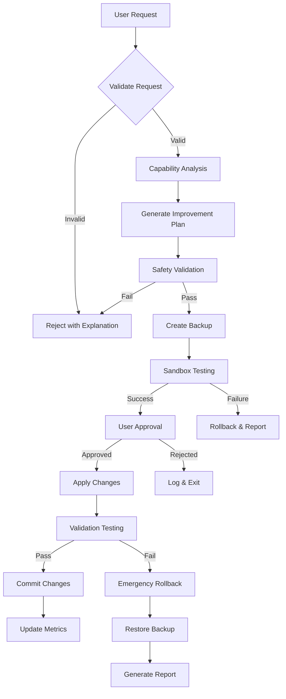

# improve-self

**Task ID:** `improve-self`  
**Versão:** 2.0.0  
**Status:** Active

---

## Propósito

Permitir que o meta-agente melhore suas próprias capacidades com salvaguardas abrangentes. Esta task permite a automodificação com verificações de segurança obrigatórias, backups e aprovação do usuário.

---

## Modos de Execução

**Escolha o modo de execução:**

### 1. Modo YOLO - Rápido, Autônomo (0-1 prompts)
- Tomada de decisão autônoma com logging
- Interação mínima com o usuário
- **Melhor para:** Tarefas simples e determinísticas

### 2. Modo Interativo - Balanceado, Educativo (5-10 prompts) **[PADRÃO]**
- Checkpoints de decisão explícitos
- Explicações educativas
- **Melhor para:** Aprendizado, decisões complexas

### 3. Planejamento Pre-Flight - Planejamento Completo Antecipado
- Fase de análise da task (identificar todas as ambiguidades)
- Execução com zero ambiguidade
- **Melhor para:** Requisitos ambíguos, trabalho crítico

**Parâmetro:** `mode` (opcional, padrão: `interactive`)

**Valores válidos:** `yolo`, `interactive`, `preflight`

**Nota:** Para tasks de auto-melhoria, o modo interativo é fortemente recomendado para garantir a consciência e a aprovação do usuário sobre as mudanças.

---

## Definição da Task (AIOX Task Format V1.0)

```yaml
task: improveSelf()
responsável: Orion (Commander)
responsavel_type: Agente
atomic_layer: Molecule

**Entrada:**
- campo: task
  tipo: string
  origem: User Input
  obrigatório: true
  validação: Must be registered task

- campo: parameters
  tipo: object
  origem: User Input
  obrigatório: false
  validação: Valid task parameters

- campo: mode
  tipo: string
  origem: User Input
  obrigatório: false
  validação: yolo|interactive|pre-flight

**Saída:**
- campo: execution_result
  tipo: object
  destino: Memory
  persistido: false

- campo: logs
  tipo: array
  destino: File (.ai/logs/*)
  persistido: true

- campo: state
  tipo: object
  destino: State management
  persistido: true
```

---

## Pré-Condições

**Propósito:** Validar pré-requisitos ANTES da execução da task (bloqueante)

**Checklist:**

```yaml
pre-conditions:
  - [ ] A task está registrada; parâmetros obrigatórios fornecidos; dependências atendidas
    tipo: pre-condition
    blocker: true
    validação: |
      Verificar se a task está registrada; parâmetros obrigatórios fornecidos; dependências atendidas
    error_message: "Pré-condição falhou: A task está registrada; parâmetros obrigatórios fornecidos; dependências atendidas"
```

---

## Execução Passo a Passo

### Passo 1: Validação da Solicitação

**Propósito:** Validar a solicitação de melhoria contra as regras de segurança

**Ações:**
1. Parsear a solicitação de melhoria
2. Verificar contra as regras de segurança
3. Verificar limitações de escopo
4. Detectar melhorias recursivas

**Validação:**
- A solicitação é válida
- Nenhuma violação de segurança
- Escopo dentro dos limites
- Nenhuma melhoria recursiva detectada

---

### Passo 2: Análise de Capacidades

**Propósito:** Analisar a implementação atual e identificar oportunidades de melhoria

**Ações:**
1. Analisar a implementação atual
2. Identificar oportunidades de melhoria
3. Avaliar viabilidade e riscos
4. Gerar relatório de capacidades

**Validação:**
- Análise concluída
- Oportunidades identificadas
- Riscos avaliados
- Relatório gerado

---

### Passo 3: Planejamento da Melhoria

**Propósito:** Gerar um plano de melhoria específico com detalhes de implementação

**Ações:**
1. Gerar mudanças específicas
2. Criar plano de implementação
3. Identificar componentes afetados
4. Estimar impacto e benefícios

**Validação:**
- Plano gerado
- Mudanças especificadas
- Componentes identificados
- Impacto estimado

---

### Passo 4: Validação de Segurança

**Propósito:** Validar o plano de melhoria contra as restrições de segurança

**Ações:**
1. Verificar breaking changes
2. Verificar a preservação de interfaces
3. Validar implicações de segurança
4. Garantir capacidade de rollback

**Validação:**
- Nenhuma breaking change
- Interfaces preservadas
- Segurança validada
- Rollback disponível

---

### Passo 5: Criação de Backup

**Propósito:** Criar um backup completo antes de aplicar as mudanças

**Ações:**
1. Backup completo dos arquivos afetados
2. Snapshot de estado para recuperação
3. Checkpoint de controle de versão
4. Documentação do plano de recuperação

**Validação:**
- Backup criado
- Estado salvo
- Checkpoint criado
- Plano de recuperação documentado

---

### Passo 6: Teste em Sandbox

**Propósito:** Testar as melhorias em ambiente isolado

**Ações:**
1. Criar ambiente de teste isolado
2. Aplicar mudanças no sandbox
3. Executar suíte de testes abrangente
4. Validar funcionalidade

**Validação:**
- Sandbox criado
- Mudanças aplicadas
- Testes aprovados
- Funcionalidade validada

---

### Passo 7: Aprovação do Usuário

**Propósito:** Solicitar aprovação explícita do usuário antes de aplicar as mudanças

**Ações:**
1. Apresentar o plano de melhoria
2. Mostrar os resultados dos testes
3. Exibir a avaliação de risco
4. Solicitar aprovação explícita

**Validação:**
- Plano apresentado
- Resultados mostrados
- Riscos divulgados
- Aprovação obtida

---

### Passo 8: Aplicação das Mudanças

**Propósito:** Aplicar as melhorias aprovadas à produção

**Ações:**
1. Aplicar as mudanças aprovadas
2. Monitorar por problemas
3. Validar em produção
4. Rastrear métricas de performance

**Validação:**
- Mudanças aplicadas
- Nenhum problema detectado
- Produção validada
- Métricas rastreadas

---

## Pós-Condições

**Propósito:** Validar o sucesso da execução APÓS a conclusão da task

**Checklist:**

```yaml
post-conditions:
  - [ ] Task concluída; código de saída 0; saídas esperadas criadas
    tipo: post-condition
    blocker: true
    validação: |
      Verificar se a task foi concluída; código de saída 0; saídas esperadas criadas
    rollback: true
    error_message: "Pós-condição falhou: Task concluída; código de saída 0; saídas esperadas criadas"
```

---

## Critérios de Aceite

**Propósito:** Validar os requisitos da story APÓS o workflow (não-bloqueante, pode ser manual)

**Checklist:**

```yaml
acceptance-criteria:
  - [ ] Task concluída conforme esperado; efeitos colaterais documentados
    tipo: acceptance-criterion
    blocker: false
    story: N/A
    manual_check: true
    validação: |
      Asseverar que a task foi concluída conforme esperado; efeitos colaterais documentados
    error_message: "Critério de aceite não atendido: Task concluída conforme esperado; efeitos colaterais documentados"
```

---

## Ferramentas (Externas/Compartilhadas)

**Propósito:** Catalogar ferramentas reutilizáveis usadas por múltiplos agentes

```yaml
**Tools:**
- github-cli:
    version: latest
    used_for: Version control operations and issue creation
    shared_with: [dev, qa, po]
    cost: $0

- task-runner:
    version: latest
    used_for: Task execution and orchestration
    shared_with: [dev, qa, po]
    cost: $0

- logger:
    version: latest
    used_for: Execution logging and error tracking
    shared_with: [dev, qa, po]
    cost: $0
```

---

## Scripts (Específicos do Agente)

**Propósito:** Código específico do agente para esta task

```yaml
**Scripts:**
- capability-analyzer.js:
    description: Analyze current capabilities and identify improvements
    language: JavaScript
    location: .aiox-core/scripts/capability-analyzer.js

- improvement-validator.js:
    description: Validate improvement plans against safety rules
    language: JavaScript
    location: .aiox-core/scripts/improvement-validator.js

- sandbox-tester.js:
    description: Test improvements in isolated sandbox environment
    language: JavaScript
    location: .aiox-core/scripts/sandbox-tester.js

- backup-manager.js:
    description: Manage backups and rollback operations
    language: JavaScript
    location: .aiox-core/scripts/backup-manager.js
```

---

## Tratamento de Erros

**Estratégia:** abort

**Erros Comuns:**

1. **Erro:** Validação de Segurança Falhou
   - **Causa:** O plano de melhoria viola as regras de segurança
   - **Resolução:** Revisar as restrições de segurança, modificar o plano
   - **Recuperação:** Rejeitar a melhoria, registrar o motivo, sugerir alternativas

2. **Erro:** Teste em Sandbox Falhou
   - **Causa:** Os testes falham no ambiente de sandbox
   - **Resolução:** Corrigir os problemas no plano de melhoria
   - **Recuperação:** Reverter o sandbox, restaurar o backup, rejeitar a melhoria

3. **Erro:** Usuário Rejeitou a Melhoria
   - **Causa:** O usuário não aprovou o plano de melhoria
   - **Resolução:** Aceitar a decisão do usuário, registrar o feedback
   - **Recuperação:** Limpar arquivos temporários, sair graciosamente

4. **Erro:** Rollback de Emergência Necessário
   - **Causa:** Falha crítica durante a aplicação das mudanças
   - **Resolução:** Restaurar imediatamente o backup
   - **Recuperação:** Restaurar todos os arquivos a partir do backup, registrar o incidente, alertar o usuário

---

## Performance

**Métricas Esperadas:**

```yaml
duration_expected: 5-15 min (estimated)
cost_estimated: $0.002-0.008
token_usage: ~2,000-5,000 tokens
```

**Notas de Otimização:**
- Fazer cache dos resultados da análise de capacidades
- Paralelizar os testes de sandbox onde for possível
- Implementar saídas antecipadas em violações de segurança

---

## Metadados

```yaml
story: STORY-6.1.7.2
version: 2.0.0
dependencies:
  - capability-analyzer.js
  - improvement-validator.js
  - sandbox-tester.js
  - backup-manager.js
tags:
  - automation
  - meta-improvement
  - self-modification
updated_at: 2025-01-17
```

## Fluxo da Task



## Entrada Obrigatória

```yaml
request: "Descrição da auto-melhoria desejada"
scope: "specific|general"  # specific = melhoria direcionada, general = otimização ampla
target_areas:  # Lista opcional de áreas a melhorar
  - performance
  - error_handling
  - capabilities
  - code_quality
constraints:  # Restrições de segurança opcionais
  max_files: 10
  require_tests: true
  preserve_interfaces: true
```

## Passos de Execução

1. **Validação da Solicitação**
   - Parsear a solicitação de melhoria
   - Verificar contra as regras de segurança
   - Verificar limitações de escopo
   - Detectar melhorias recursivas

2. **Análise de Capacidades**
   - Analisar a implementação atual
   - Identificar oportunidades de melhoria
   - Avaliar viabilidade e riscos
   - Gerar relatório de capacidades

3. **Planejamento da Melhoria**
   - Gerar mudanças específicas
   - Criar plano de implementação
   - Identificar componentes afetados
   - Estimar impacto e benefícios

4. **Validação de Segurança**
   - Verificar breaking changes
   - Verificar a preservação de interfaces
   - Validar implicações de segurança
   - Garantir capacidade de rollback

5. **Criação de Backup**
   - Backup completo dos arquivos afetados
   - Snapshot de estado para recuperação
   - Checkpoint de controle de versão
   - Documentação do plano de recuperação

6. **Teste em Sandbox**
   - Criar ambiente de teste isolado
   - Aplicar mudanças no sandbox
   - Executar suíte de testes abrangente
   - Validar funcionalidade

7. **Aprovação do Usuário**
   - Apresentar o plano de melhoria
   - Mostrar os resultados dos testes
   - Exibir a avaliação de risco
   - Solicitar aprovação explícita

8. **Aplicação das Mudanças**
   - Aplicar as mudanças aprovadas
   - Monitorar por problemas
   - Validar em produção
   - Rastrear métricas de performance

9. **Pós-Implementação**
   - Atualizar a documentação
   - Registrar no histórico de modificações
   - Gerar relatório de métricas
   - Agendar revisão de acompanhamento

## Formato de Saída

```yaml
improvement_id: "self-imp-{timestamp}-{hash}"
status: "completed|failed|rolled_back"
analysis:
  current_capabilities:
    - capability: "tratamento de erros"
      score: 7.5
      issues: ["sem lógica de retry", "mensagens de erro básicas"]
  proposed_improvements:
    - area: "tratamento de erros"
      changes: ["adicionar mecanismo de retry", "enriquecer o contexto de erro"]
      impact: "medium"
      risk: "low"
modifications:
  - file: "utils/error-handler.js"
    type: "enhancement"
    changes: 15
    tests_added: 3
validation:
  sandbox_results:
    tests_passed: 45
    tests_failed: 0
    performance_impact: "+5%"
  safety_checks:
    breaking_changes: false
    interface_preserved: true
    security_validated: true
metrics:
  improvement_score: 8.2
  risk_score: 2.1
  confidence: 0.87
rollback_info:
  backup_id: "backup-123"
  restore_command: "node restore.js backup-123"
```

## Regras de Segurança

### Salvaguardas Obrigatórias
1. **Sem Modificações no Sistema Central**
   - Não pode modificar arquivos de bootstrap
   - Não pode alterar validadores de segurança
   - Não pode alterar mecanismos de rollback
   - Não pode modificar verificações de segurança

2. **Proteção Recursiva**
   - Detectar melhorias circulares
   - Limitar a profundidade de melhoria a 1
   - Rastrear o histórico de melhorias
   - Prevenir loops infinitos

3. **Preservação de Interfaces**
   - Todas as APIs públicas devem permanecer compatíveis
   - As interfaces de task não podem mudar
   - As assinaturas de comando preservadas
   - Os formatos de configuração mantidos

4. **Requisitos de Teste**
   - Todas as mudanças devem ter testes
   - Os testes existentes devem passar
   - A cobertura não pode diminuir
   - Benchmarks de performance atingidos

5. **Gates de Aprovação**
   - Aprovação do usuário obrigatória
   - Resumo das mudanças obrigatório
   - Avaliação de risco exibida
   - Plano de rollback disponível

### Fallback de Modo Seguro
```javascript
// Always maintain safe mode entry point
if (process.env.AIOX_SAFE_MODE === 'true') {
  console.log('Running in safe mode - self-modification disabled');
  process.exit(0);
}
```

## Implementação

```javascript
const CapabilityAnalyzer = require('../scripts/capability-analyzer');
const ImprovementValidator = require('../scripts/improvement-validator');
const SandboxTester = require('../scripts/sandbox-tester');
const BackupManager = require('../scripts/backup-manager');
// const MetricsTracker = require('../scripts/metrics-tracker'); // Archived in Story 3.18

module.exports = {
  name: 'improve-self',
  description: 'Enable meta-agent self-improvement with safeguards',
  
  async execute(params) {
    const { request, scope = 'specific', target_areas = [], constraints = {} } = params;
    
    // Initialize safety systems
    const validator = new ImprovementValidator();
    const analyzer = new CapabilityAnalyzer();
    const sandbox = new SandboxTester();
    const backup = new BackupManager();
    // const metrics = new MetricsTracker(); // Archived in Story 3.18
    
    try {
      // Step 1: Validate request
      const validation = await validator.validateRequest({
        request,
        scope,
        constraints
      });
      
      if (!validation.valid) {
        return {
          success: false,
          reason: validation.reason,
          suggestions: validation.suggestions
        };
      }
      
      // Step 2: Analyze capabilities
      const analysis = await analyzer.analyzeCapabilities({
        target_areas,
        currentImplementation: './aiox-core'
      });
      
      // Step 3: Generate improvement plan
      const plan = await analyzer.generateImprovementPlan({
        analysis,
        request,
        constraints
      });
      
      // Step 4: Safety validation
      const safety = await validator.validateSafety(plan);
      if (!safety.safe) {
        return {
          success: false,
          reason: 'Safety validation failed',
          risks: safety.risks
        };
      }
      
      // Step 5: Create backup
      const backupId = await backup.createFullBackup({
        files: plan.affectedFiles,
        metadata: {
          improvement_id: plan.id,
          timestamp: new Date().toISOString()
        }
      });
      
      // Step 6: Sandbox testing
      const sandboxResults = await sandbox.testImprovements({
        plan,
        backupId
      });
      
      if (!sandboxResults.success) {
        await backup.restoreBackup(backupId);
        return {
          success: false,
          reason: 'Sandbox testing failed',
          results: sandboxResults
        };
      }
      
      // Step 7: User approval
      const approval = await this.requestUserApproval({
        plan,
        analysis,
        sandboxResults,
        safety
      });
      
      if (!approval.approved) {
        return {
          success: false,
          reason: 'User rejected improvements',
          user_feedback: approval.feedback
        };
      }
      
      // Step 8: Apply changes
      const application = await this.applyImprovements({
        plan,
        backupId
      });
      
      // Step 9: Post-implementation
      await metrics.recordImprovement({
        improvement_id: plan.id,
        metrics: application.metrics,
        analysis,
        plan
      });
      
      return {
        success: true,
        improvement_id: plan.id,
        analysis,
        modifications: application.modifications,
        metrics: application.metrics,
        rollback_info: {
          backup_id: backupId,
          restore_command: `*restore-backup ${backupId}`
        }
      };
      
    } catch (error) {
      // Emergency rollback
      if (backup.hasActiveBackup()) {
        await backup.emergencyRestore();
      }
      
      return {
        success: false,
        error: error.message,
        emergency_rollback: true
      };
    }
  },
  
  async requestUserApproval({ plan, analysis, sandboxResults, safety }) {
    console.log(chalk.yellow('\n=== SELF-IMPROVEMENT APPROVAL REQUEST ===\n'));
    
    console.log(chalk.blue('Improvement Plan:'));
    console.log(`- Target: ${plan.target_areas.join(', ')}`);
    console.log(`- Files affected: ${plan.affectedFiles.length}`);
    console.log(`- Risk level: ${safety.risk_level}`);
    
    console.log(chalk.blue('\nProposed Changes:'));
    plan.changes.forEach(change => {
      console.log(`- ${change.description}`);
      console.log(`  Impact: ${change.impact}, Risk: ${change.risk}`);
    });
    
    console.log(chalk.green('\nSandbox Test Results:'));
    console.log(`- Tests passed: ${sandboxResults.tests_passed}/${sandboxResults.total_tests}`);
    console.log(`- Performance impact: ${sandboxResults.performance_impact}`);
    console.log(`- No breaking changes: ${sandboxResults.no_breaking_changes}`);
    
    const { approve } = await inquirer.prompt([{
      type: 'confirm',
      name: 'approve',
      message: 'Do you approve these self-improvements?',
      default: false
    }]);
    
    if (approve) {
      const { feedback } = await inquirer.prompt([{
        type: 'input',
        name: 'feedback',
        message: 'Any additional constraints or feedback?'
      }]);
      
      return { approved: true, feedback };
    }
    
    return { approved: false };
  }
};
```

## Dependências
- capability-analyzer.js
- improvement-validator.js
- sandbox-tester.js
- backup-manager.js
- modification-history.js
- git-wrapper.js

## Requisitos de Teste
- Configuração do ambiente de sandbox
- Cenários de melhoria mockados
- Testes de validação de segurança
- Verificação de rollback
- Testes de acurácia de métricas

## Considerações de Segurança
- Todas as melhorias exigem aprovação explícita
- Teste em sandbox obrigatório
- Backup completo antes das mudanças
- Rollback de emergência disponível
- Trilha de auditoria mantida
- Bypass de modo seguro disponível

## Melhorias Comuns
1. **Enriquecimento do Tratamento de Erros**
   - Adicionar lógica de retry
   - Melhorar as mensagens de erro
   - Adicionar rastreamento de contexto

2. **Otimização de Performance**
   - Otimizar algoritmos
   - Adicionar camadas de cache
   - Reduzir operações de I/O

3. **Extensão de Capacidades**
   - Adicionar novas funções utilitárias
   - Enriquecer funcionalidades existentes
   - Melhorar integrações

4. **Qualidade de Código**
   - Refatorar funções complexas
   - Melhorar a modularidade
   - Enriquecer a documentação

## Métricas Rastreadas
- Taxa de sucesso de melhorias
- Impacto na performance
- Pontuações de qualidade de código
- Mudanças na cobertura de testes
- Satisfação do usuário
- Frequência de rollback
