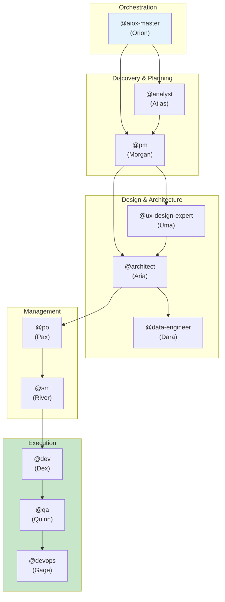

# AIOX Agent Flows - Documentação Detalhada dos Agentes

> **EN** | [PT](../../aiox-agent-flows/README.md) | [ES](../../es/aiox-agent-flows/README.md) | [ZH](../../zh/aiox-agent-flows/README.md)

---

**Versão:** 1.0.0
**Última Atualização:** 2026-02-05
**Status:** Documentação Oficial

---

## Visão Geral

Esta pasta contém a documentação detalhada de todos os agentes AIOX, incluindo:

- **Sistema completo** de cada agente
- **Fluxogramas Mermaid** das operações
- **Mapeamento de comandos** para tasks
- **Integrações** entre os agentes
- **Workflows** que envolvem cada agente
- **Boas práticas** e troubleshooting

---

## Agentes Documentados

| Agente | Persona | Arquétipo | Documento |
|-------|---------|-----------|----------|
| **@aiox-master** | Orion | Orquestrador | [aiox-master-system.md](./aiox-master-system.md) |
| **@analyst** | Atlas | Pesquisador | [analyst-system.md](./analyst-system.md) |
| **@architect** | Aria | Visionário | [architect-system.md](./architect-system.md) |
| **@data-engineer** | Dara | Sábio dos Dados | [data-engineer-system.md](./data-engineer-system.md) |
| **@dev** | Dex | Construtor | [dev-system.md](./dev-system.md) |
| **@devops** | Gage | Guardião | [devops-system.md](./devops-system.md) |
| **@pm** | Morgan | Estrategista | [pm-system.md](./pm-system.md) |
| **@qa** | Quinn | Guardião | [qa-system.md](./qa-system.md) |
| **@sm** | River | Facilitador | [sm-system.md](./sm-system.md) |
| **@squad-creator** | Nova | Criador | [squad-creator-system.md](./squad-creator-system.md) |
| **@ux-design-expert** | Uma | Designer | [ux-design-expert-system.md](./ux-design-expert-system.md) |

---

## Estrutura do Documento

Cada documento de agente segue esta estrutura padrão:

```
1. Visão Geral
   - Responsabilidades principais
   - Princípios fundamentais

2. Lista Completa de Arquivos
   - Tasks principais
   - Definição do agente
   - Templates
   - Checklists
   - Arquivos relacionados

3. Fluxograma do Sistema
   - Diagrama Mermaid completo
   - Fluxo de operações

4. Mapeamento de Comandos
   - Comandos -> Tasks
   - Parâmetros e opções

5. Workflows Relacionados
   - Workflows que usam o agente
   - Papel do agente em cada workflow

6. Integrações do Agente
   - Quem fornece entradas
   - Quem recebe saídas
   - Colaborações

7. Configuração
   - Arquivos de configuração
   - Ferramentas disponíveis
   - Restrições

8. Boas Práticas
   - Quando usar
   - O que evitar

9. Troubleshooting
   - Problemas comuns
   - Soluções

10. Changelog
    - Histórico de versões
```

---

## Diagrama de Relacionamento entre Agentes



---

## Como Usar Esta Documentação

### Para Entender um Agente

1. Acesse o documento do agente desejado
2. Leia a **Visão Geral** para entender o papel
3. Consulte os **Comandos** para saber o que ele pode fazer
4. Veja os **Workflows** para entender o contexto

### Para Depurar Problemas

1. Vá diretamente à seção de **Troubleshooting**
2. Consulte os **Fluxogramas** para entender o fluxo
3. Verifique as **Integrações** quanto a dependências

### Para Estender o Sistema

1. Analise a **Lista de Arquivos** para saber o que modificar
2. Siga as **Boas Práticas** para manter a consistência
3. Atualize o **Changelog** após as mudanças

---

## Relação com Outras Documentações

| Documentação | Localização | Propósito |
|---------------|----------|---------|
| Comandos Meta-Agente | [docs/meta-agent-commands.md](../../meta-agent-commands.md) | Referência rápida |
| Guia de Workflows | [docs/guides/workflows-guide.md](../../guides/workflows-guide.md) | Guia de workflows |
| AIOX Workflows | [docs/aiox-workflows/](../../aiox-workflows/) | Workflows detalhados |
| Arquitetura | [docs/architecture/](../../architecture/) | Arquitetura técnica |

---

## Contribuindo

Para adicionar ou atualizar a documentação dos agentes:

1. Siga a estrutura padrão descrita acima
2. Inclua diagramas Mermaid atualizados
3. Mantenha o changelog em dia
4. Crie traduções em PT e ES

---

*AIOX Agent Flows Documentation v1.0 - Documentação detalhada do sistema de agentes*
